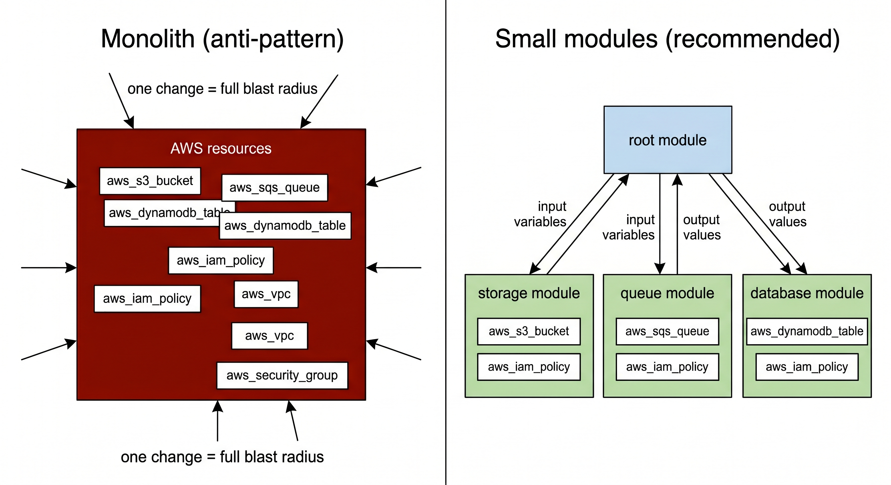

# 生产就绪代码

"能跑起来"和"能放到生产上"是两件完全不同的事。

把一个 S3 存储桶的 Terraform 配置写出来，五分钟就能完成。但在生产上，这个存储桶还需要版本控制、加密、访问日志、跨区域备份、成本标签，以及一套 IAM 策略保证只有该访问的角色才能访问。这些需求没有一个在 `terraform apply` 的时候会自动提醒你。

本章从**为什么基础设施项目往往比预期慢**讲起，给出一张完整的生产化检查清单，再深入四个最核心的工程实践：小模块、可组合、内置防护、版本固定。最后用一套从单体一步步重构到模块化的动手实验，把这些原则落到实处。

## 目录

- [为什么总是比预期慢](#为什么总是比预期慢)
- [生产级基础设施检查清单](#生产级基础设施检查清单)
- [四大工程实践](#四大工程实践)
  - [小模块原则](#小模块原则)
  - [可组合模块](#可组合模块)
  - [内置防护](#内置防护)
  - [版本固定](#版本固定)
- [动手实验：从单体到模块化](#动手实验从单体到模块化)

---

## 为什么总是比预期慢

### 工期参考

下表是基于实践经验总结的工期参考，不同规模的团队和技术积累可能有所出入，但数量级基本成立：

| 类型 | 典型例子 | 工期参考 |
|------|---------|---------|
| 托管服务 | Amazon RDS、S3 | **1–2 周** |
| 无状态分布式服务 | Auto Scaling Group 集群 | **2–4 周** |
| 有状态分布式服务 | Elasticsearch 集群 | **2–4 个月** |
| 完整架构 | 全套：应用、数据库、监控、安全… | **6–36 个月** |

许多人第一次看到这张表时的反应是："几个月？这也太夸张了吧。"但凡经历过一次从零到生产的完整交付，通常就不会再这么想了。

为什么会这么慢？原因大致有三类：

**工具链本身不够成熟**。基础设施即代码仍然是个相对年轻的领域，工具之间的整合、文档的覆盖、最佳实践的沉淀都还在快速变化，还没到像写 CRUD 接口那样"按成熟套路打" 的程度。

**每个变更都容易扯出其他问题**。改一行 DNS 配置，发现证书要更新；更新证书，发现 CI 流水线里的旧版 CLI 不支持新格式；修 CI，发现又依赖了一个即将停止维护的第三方 Action……基础设施的各个部分高度耦合，很少有"只动一个地方"的修改。这种连环踩坑消耗的时间，比功能开发本身多得多。

**生产化本来就有一张很长的清单**。这是最根本的原因。部署一个服务，不只是让它跑起来，还要让它在流量突增时不崩、在磁盘满了时有告警、在一个可用区挂掉时能自动切换……这张清单上的大多数条目，在估算工期时都不会被主动想到，但在上线后都会一一找上门来。

---

## 生产级基础设施检查清单

"什么叫生产就绪"，不同的人往往有不同的答案。有人想到监控，有人想到高可用，有人想到安全。各说各的，说明这件事从来没有被明确定义过——于是每次上线都各凭经验，漏掉的东西各不相同。

把这些条目列成清单，在每个项目启动时对照一遍，明确哪些做、哪些暂不做、为什么，比等到上线后被问题倒逼靠谱得多：

| 类别 | 需要考虑的问题 | 常见工具参考 |
|------|--------------|------------|
| **安装** | 二进制与依赖如何分发？版本如何管理？ | Docker、Packer、Ansible |
| **配置** | 端口、TLS 证书、服务发现、主从？ | Terraform、K8s ConfigMap |
| **关联** | VPC、子网、安全组、IAM 权限？ | Terraform |
| **部署** | 如何实现零停机发布？蓝绿/滚动/金丝雀？ | ASG、K8s、ECS |
| **高可用** | 单个实例/服务/可用区挂掉后怎样？ | 多 AZ、多 Region |
| **可扩展** | 如何在负载变化时自动扩缩容？ | Auto Scaling |
| **性能** | CPU/内存/磁盘/网络有没有瓶颈？ | 压测、Profiling |
| **网络** | IP/端口规划、服务发现、防火墙、VPN？ | VPC、Route 53 |
| **安全** | 传输加密、静态加密、密钥管理、最小权限？ | KMS、IAM、Vault |
| **监控** | 关键指标是什么？告警阈值怎么定？ | CloudWatch、Datadog |
| **日志** | 日志收集到哪里？保留多久？ | ELK、Sumo Logic |
| **数据备份** | 数据库怎么备份？备份是否跨区域？ | AWS Backup、RDS Snapshots |
| **成本优化** | 实例规格是否过度？有没有闲置资源？ | Infracost、Reserved Instances |
| **文档** | 架构图、README、Runbook 在哪里？ | README、Wiki |
| **测试** | 基础设施代码有没有自动化测试？ | Terratest、tflint、OPA |

::: tip 关于"跳过"
跳过某一项不是问题，问题是不知道自己跳过了。"这个环境不需要跨区域备份，因为它是临时的演示环境"是一个成熟的决策；"哦，备份这件事我们好像从来没考虑过"则不是。把跳过的项目连同理由记入 README，以后接手的人也不会一头雾水。
:::

---

## 四大工程实践

清单告诉我们"要做什么"，工程实践决定"代码能不能支撑我们把这些事做好"。以下四个实践，是模块化 Terraform 代码库最核心的设计原则。

### 小模块原则

见过这种代码吗：一个 `main.tf` 里有 VPC、EC2、RDS、S3、IAM、CloudWatch，几百行，注释寥寥，改一处不知道会不会影响别处。在应用代码里，我们把这种东西叫做"上帝类"，在 Terraform 里，对应的是大模块。

**大模块是怎么把事情搞复杂的**：

- **慢**：每次 `plan` 都要向 AWS API 查询所有资源的当前状态，资源越多 plan 越慢，几百个资源可能要等十几分钟
- **权限失控**：想改队列配置，却必须拥有操作数据库的权限——因为它们在同一个模块里，无法分开授权
- **牵一发动全身**：`plan` 输出上百行时，没有人会认真逐行审查，于是那一行"将删除生产数据库"很容易被忽略
- **难以独立测试**：想测 SQS 队列的行为，却必须同时 apply 一整套 VPC 和 IAM

拆的原则很直接：**一个模块做一件事，如果需要加"以及"来描述它做了什么，就说明它做了太多事**。



按基础设施的职责层次拆分，是一个常见且好用的切入点：
- 网络层（VPC、子网、安全组）
- 存储层（S3、数据库）
- 消息层（SQS、SNS）
- 计算层（Lambda、EC2、ECS）
- 权限层（IAM）

每一层独立管理，独立演进，相互之间只靠输入/输出变量通信。

---

### 可组合模块

模块拆小之后，"怎么把它们连接起来"就成了下一个问题。

Terraform 的连接机制很简单：`variable` 是模块的入口，`output` 是模块的出口。一个模块的 output 可以直接传给另一个模块的 variable——这就是模块组合。设计良好的模块不在内部硬编码任何外部资源的引用，所有依赖都通过 variable 注入，所有有用的属性都通过 output 暴露：

```hcl
# modules/storage/main.tf — 可复用的 S3 存储桶封装
resource "aws_s3_bucket" "this" {
  bucket = var.bucket_name
}

resource "aws_s3_bucket_versioning" "this" {
  bucket = aws_s3_bucket.this.id
  versioning_configuration {
    status = var.enable_versioning ? "Enabled" : "Suspended"
  }
}
```

```hcl
# modules/storage/outputs.tf — 把有用的属性暴露出去
output "bucket_arn" {
  value = aws_s3_bucket.this.arn
}
```

```hcl
# 根模块 main.tf — 把小模块组合成完整系统
module "storage" {
  source      = "./modules/storage"
  bucket_name = "${var.app_name}-${var.environment}-config"
}

module "queue" {
  source     = "./modules/queue"
  queue_name = "${var.app_name}-${var.environment}-notify"
}

# 把 storage 模块的 output 传给 iam 资源
resource "aws_iam_policy" "reader" {
  policy = jsonencode({
    Statement = [{
      Resource = module.storage.bucket_arn  # 来自 storage 模块的输出
    }]
  })
}
```

这段代码里，`aws_iam_policy.reader` 的 `Resource` 字段直接引用了 `module.storage.bucket_arn`——存储模块的输出成了权限模块的输入。各模块各司其职，根模块负责把它们串联起来，整个配置的结构一目了然。

#### 使用社区模块（terraform-aws-modules）

不是所有模块都需要自己写。[terraform-aws-modules](https://github.com/terraform-aws-modules) 是社区维护的 AWS 模块集合，S3、VPC、RDS、Lambda、ECS 等常见服务都有对应的模块，里面包含了大量生产环境中需要考虑的配置细节，比自己从头写要可靠得多：

```hcl
# modules/storage/main.tf — 调用社区模块
module "s3_bucket" {
  source  = "terraform-aws-modules/s3-bucket/aws"
  version = "~> 4.2"

  bucket = var.bucket_name

  versioning = {
    enabled = var.enable_versioning
  }
}
```

如果你的团队主要使用 Azure，社区模块的对等项目是 **[Azure Verified Modules（AVM）](https://aka.ms/avm)**。AVM 是微软官方主导、社区共同维护的 Azure 模块标准，覆盖虚拟机、存储账户、Key Vault、AKS、网络等常见 Azure 资源，模块命名、接口风格、输出结构都遵循统一的规范。与 terraform-aws-modules 不同的是，AVM 由微软参与审核，质量门槛更一致，适合在企业内部制定平台工程标准时作为基准使用：

```hcl
# 使用 AVM 的存储账户模块
module "storage_account" {
  source  = "Azure/avm-res-storage-storageaccount/azurerm"
  version = "~> 0.5"

  resource_group_name = var.resource_group_name
  name                = var.storage_account_name
  location            = var.location
}
```


::: tip 要不要包一层
直接在根模块调用社区模块完全可以，不强制要求包装。但如果项目里多个地方都用同一个社区模块，包一层自己的模块会有好处：社区模块升级时只改一处，还可以在包装层统一注入公司标准的标签、命名规范、默认配置。如果只用一次，直接调用就好，不要为了"规范"制造不必要的层级。
:::

---

### 内置防护

模块的调用者可能不了解底层限制：传一个超长的 S3 bucket 名字、把 SQS 保留时长设成负数、误把 DynamoDB 改成预置容量……这些错误不应该等到 AWS API 报错才发现，更不应该等到 apply 完成后才发现。

Terraform 提供三个层次的内置防护，覆盖部署前、部署中、部署后三个阶段：

#### 1. validation 块：变量合法性检查

在 `plan`/`apply` 开始之前就执行，最早拦截非法输入：

```hcl
variable "message_retention_seconds" {
  type    = number
  default = 86400

  validation {
    condition     = var.message_retention_seconds >= 60 && var.message_retention_seconds <= 1209600
    error_message = "消息保留时长必须在 60（1 分钟）到 1209600（14 天）秒之间。"
  }
}
```

**限制**：`validation` 里只能引用当前变量本身，不能用数据源或其他变量做动态判断。需要更复杂的检查时，用下面两种机制。

#### 2. precondition 块：apply 之前的前置断言

可以引用数据源和表达式，适合做跨变量的约束或需要运行时数据才能判断的检查：

```hcl
resource "aws_s3_bucket" "this" {
  bucket = var.bucket_name

  lifecycle {
    precondition {
      condition     = length(var.bucket_name) >= 3 && length(var.bucket_name) <= 63
      error_message = "S3 存储桶名称长度必须在 3 到 63 个字符之间（AWS 规范）。"
    }
  }
}
```

相比 `validation`，`precondition` 触发时机稍晚（在 plan 阶段分析资源图时），但更灵活。错误信息会明确告知是哪个 precondition 失败，而不是抛出一个模糊的 API 错误码。

#### 3. postcondition 块：apply 之后的结果验证

用 `self` 引用资源 apply 后的实际属性，验证结果是否符合模块的行为承诺：

```hcl
resource "aws_dynamodb_table" "this" {
  # ...
  lifecycle {
    postcondition {
      condition     = self.billing_mode == "PAY_PER_REQUEST"
      error_message = "审计日志表必须使用 PAY_PER_REQUEST，以避免预置容量浪费。"
    }
  }
}
```

`postcondition` 的价值在于文档化模块的**行为契约**——不管以后谁来重构这个模块，只要这个断言还在，就不可能在不知情的情况下改掉这个关键保证。

#### 选用原则

| 工具 | 何时使用 |
|------|---------|
| `validation` | 变量的基础合法性检查（首选，最接近被校验的变量） |
| `precondition` | 跨变量/数据源的前置假设检查 |
| `postcondition` | 模块行为保证（apply 之后验证） |
| 自动化测试（Terratest/OPA） | 复杂的动态断言（HTTP 检查、多资源交叉验证等） |

---

### 版本固定

"同样的代码，今天 apply 和三个月后 apply，结果应该一样"——这是基础设施可重现性的基本要求。但如果不固定依赖版本，provider 或社区模块的一次隐式升级就可能改变行为，故障排查时根本找不到变量在哪里。

Terraform 代码有三类依赖，每类都需要单独处理：

#### 1. Terraform 核心版本

`terraform.required_version` 控制哪些版本的 Terraform 才能执行这份配置：

```hcl
terraform {
  # 允许所有 1.x，拒绝 2.0 进入
  required_version = ">= 1.5, < 2.0"
}
```

如果团队对版本一致性要求更严格，可以锁定到具体版本：
```hcl
required_version = "1.14.8"
```

::: warning 精确版本锁定只适用于根模块
把 `required_version` 锁死到一个具体版本，**只在根模块里才合理**。如果你写的是一个供他人调用的可复用模块，锁死版本相当于强迫所有调用方都用同一个 Terraform 版本——一旦两个模块要求的版本不一致，调用方无处妥协，直接报错。可复用模块里只写宽松的范围约束（如 `>= 1.5`），把精确版本的控制权留给最终的根模块。
:::

团队里多个人并行开发、CI/CD 机器与本地版本不一致时，[tfenv](https://github.com/tfutils/tfenv) 可以解决这个问题：在项目根目录放一个 `.terraform-version` 文件，写上版本号，tfenv 会自动让所有 `terraform` 命令使用该版本。

#### 2. Provider 版本

```hcl
terraform {
  required_providers {
    aws = {
      source  = "hashicorp/aws"
      version = "~> 6.0"  # 只允许 6.x，不允许 7.0
    }
  }
}
```

`required_providers` 只定义约束范围，真正锁住具体版本的是 `terraform init` 生成的 `.terraform.lock.hcl` 文件，里面记录了实际安装的版本号和哈希校验值。**这个文件必须提交到版本控制**，否则不同机器上 `init` 拿到的 provider 版本可能不同。

想主动升级 provider 时，不能直接修改 `lock` 文件，要走正式流程：

```bash
# 按照 required_providers 里的约束重新解析并更新 lock 文件
terraform init -upgrade
```

#### 3. 模块版本

对于来自 Terraform Registry 的社区模块：

```hcl
module "s3_bucket" {
  source  = "terraform-aws-modules/s3-bucket/aws"
  version = "~> 4.2"  # 固定到 4.x 系列
  # ...
}
```

对于来自 Git 的私有模块：

```hcl
module "app" {
  source = "git@github.com:your-org/modules.git//services/app?ref=v1.2.3"
}
```

::: warning .terraform.lock.hcl 要提交
这个文件的作用等同于 Node.js 的 `package-lock.json` 或 Go 的 `go.sum`——它记录的是"我上次 init 时实际装了哪个版本、哈希是多少"。不提交这个文件，版本固定就只是写在配置里的约束范围，而不是真正被锁住的版本。
:::

---

## 动手实验：从大泥球到模块化

我们以一个**配置变更通知系统**为例，把上面的原则串联起来：

- **S3 存储桶**（`modules/storage/`）：存储应用配置文件，开启版本控制
- **SQS 队列**（`modules/queue/`）：配置变更事件通知，含死信队列
- **DynamoDB 表**（`modules/database/`）：变更审计日志
- **IAM 策略**：应用程序访问权限

这个系统不大，但覆盖了存储、消息、数据、权限四个层——足以感受模块拆分前后的差异。

实验分四步，每一步都在前一步的基础上演进：
1. **观察大模块**：所有资源堆在一个文件里，先感受一下它的"重量"
2. **拆分小模块**：把单体拆成三个职责单一的子模块，看看结构清晰后的变化
3. **引入社区模块**：用 `terraform-aws-modules/s3-bucket` 替换自制存储模块，接口不变
4. **内置防护 + 版本固定**：加入 validation、precondition、postcondition 和版本约束，让模块更健壮

<KillercodaEmbed src="https://killercoda.com/lonegunman-terraform-tutorial/course/terraform-tutorial/terraform-production-ready" title="生产就绪代码：从大泥球到模块化" />
